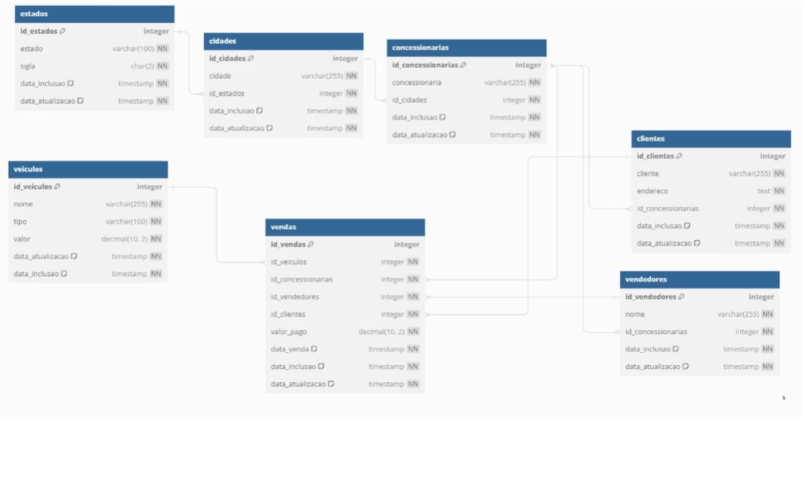
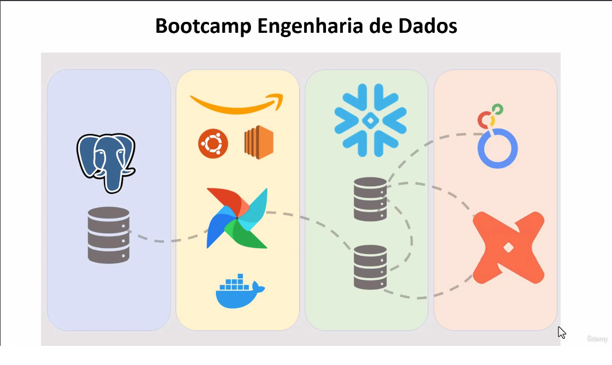
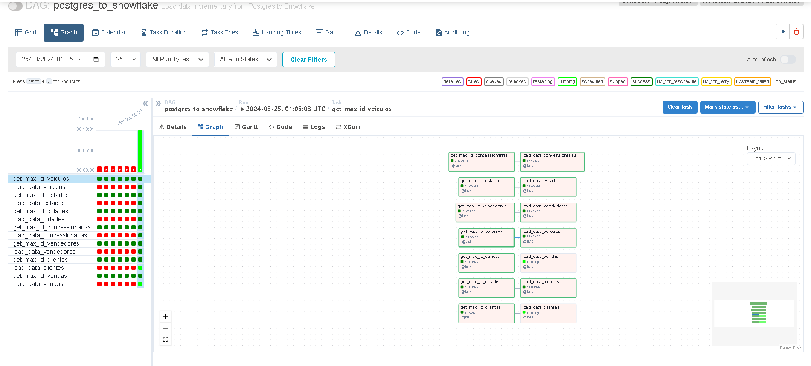
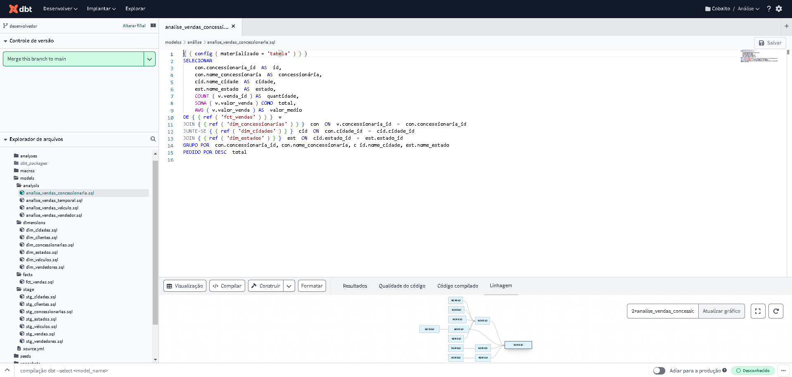

# Projeto - CobaltoDriver

>Resolução de problemas de negócio simulados e soluções de requisições utilizando Datawarehouse AWS Redshift, AWS S3 e BD Relacional.

## Objetivo: 

Construa um Pipeline de Dados com Snowflake, Airflow, dbt, Postgres e Looker Studio.

O esquema do BD Relacional da empresa se dá de acordo com a imagem:

<!-- colocar screenshoot do seu projeto -->

## Preparação do ambiente

Para realizar as atividades propostas, utilizou-se da seguinte estrutura:
 
* Criação do Banco Postgresql;
* Subir uma maquina linux/unix, tanto no AWS EC2 ou maquina virtual ou local;
* Configurar o Airflow com Docker no Ubuntu;
* Criação estrutura snowflake;
* Criar Dags e carregar os dados para area de stage;
* Transformar dados no dbt e construir a camada analítica.
* Contruir o dashboard;

## Postgresql

## Criação do ambiente linux/Unix

* Minha maquina possui o sistema operacional Widnows, para a criação do ambiente entrei no powershell como admin.
* com o comando wsl --install baixei o ambiente Ubuntu.

## Instalar e configurar o airflow no ubuntu
#1- Atualizar a lista de pacotes do APT:
sudo apt-get update
 
#2-Instalar pacotes necessários para adicionar um novo repositório via HTTPS:
sudo apt-get install ca-certificates curl gnupg lsb-release
 
#3- Criar diretório para armazenar as chaves de repositórios 
sudo mkdir -m 0755 -p /etc/apt/keyrings
 
#4- Adicionar a chave GPG do repositório do Docker:
curl -fsSL https://download.docker.com/linux/ubuntu/gpg | sudo gpg --dearmor -o /usr/share/keyrings/docker-archive-keyring.gpg
 
#5- Adicionar o repositório do Docker às fontes do APT:
echo "deb [arch=$(dpkg --print-architecture) signed-by=/usr/share/keyrings/docker-archive-keyring.gpg] https://download.docker.com/linux/ubuntu $(lsb_release -cs) stable" | sudo tee /etc/apt/sources.list.d/docker.list > /dev/null
 
#6- Atualiza a lista de pacotes após adicionar o novo repositório do Docker
sudo apt-get update
 
#7- Instalar o Docker e componentes
sudo apt-get install docker-ce docker-ce-cli containerd.io docker-buildx-plugin docker-compose-plugin
 
#8- Baixar o arquivo docker-compose.yaml do Airflow:
curl -LfO 'https://airflow.apache.org/docs/apache-airflow/stable/docker-compose.yaml'
 
#9- Criar diretórios para DAGs, logs e plugins:
mkdir -p ./dags ./logs ./plugins
 
#10- Criar um arquivo .env com o UID do usuário, usado pelo docker para permissões
echo -e "AIRFLOW_UID=$(id -u)" > .env
 
#11- inicia o airflow
sudo  docker compose up airflow-init
 
#12 -subir o Airflow em modo desacoplado
sudo docker compose up -d
 
#aguardar até tudo estar healty
 
#copiar Public IPv4 DNS e colocar porta 8080, 
#este é só um exemplo:
http://ec2-35-175-126-189.compute-1.amazonaws.com:8080/
 
#editar
nano /home/ubuntu/docker-compose.yaml
 
#mudar para falso
AIRFLOW__CORE__LOAD_EXAMPLES: 'true'
 
#reiniciar
sudo docker compose stop
sudo docker compose up -d
sudo docker ps

## Criar e configurar DW no Snowflake

## Criação das dags

## Transformar dados e construir a camada analítica

## Dashboard

## Arquivos de resolução

Os arquivos de resolução se encontram anexados e separados por atividade. Consistem em scripts SQL e Python.

_______
## Meta

Link do curso: <https://www.udemy.com/course/bootcamp-engenharia-de-dados/learn/>

Guilherme de Oliveira Claudino --- [Linkedin](https://www.linkedin.com/in/guilherme-de-oliveira-claudino-/) --- [e-mail] guilherme_job@hotmail.com

Currículo online: <>

